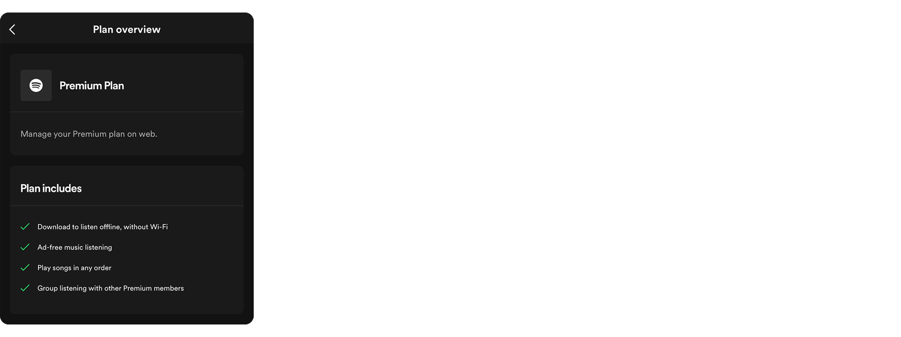
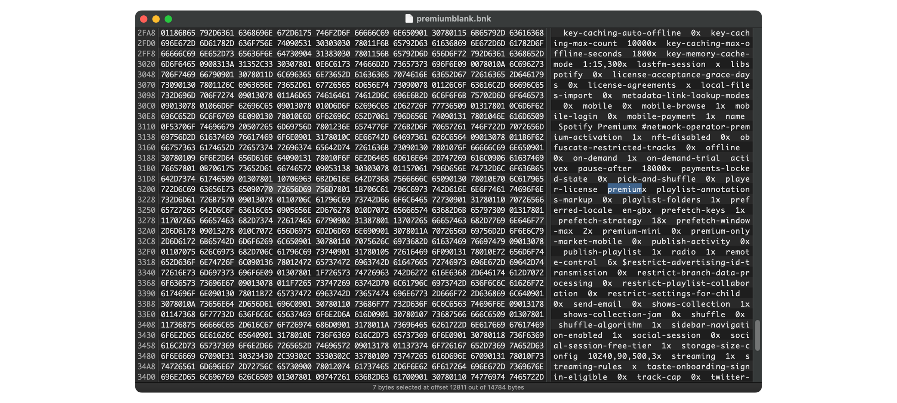

# EeveeSpotify

This tweak makes Spotify think that you have a Premium subscription, granting free listening, just like Spotilife.

## The History

Several months ago, Spotilife, the only tweak to get Spotify Premium, stopped working on new Spotify versions. I decompiled Spotilife, reverse-engineered Spotify, intercepted requests, etc., and created this tweak.

## Restrictions

Please refrain from opening issues about the following features, as they are server-sided and will **NEVER** work:

- Very High audio quality
- Native playlist downloading (you can download podcast episodes though)
- Jam (hosting a Spotify Jam requires Premium, joining by link currently works only with Jailbreak/TrollStore).

EeveeSpotify replaces Spotify monthly limited lyrics with Genius. If the tweak is unable to find a song or process the lyrics, you'll see the original Spotify one.

In theory, implementing downloading/offline mode locally *should* be possible, but it will **not** be included in this tweak.

## How It Works

Upon login, Spotify fetches user data, including active subscription, and caches it in the `offline.bnk` file in the `/Library/Application Support/PersistentCache` directory. It uses its proprietary binary format to store data, incorporating a length byte before each value, among other conventions. Certain keys, such as `player-license`, `financial-product`, and `type`, determines the user abilities.

The tweak patches this file while initializing; Spotify loads it and assumes you have Premium. To be honest, it doesn't really patch due to challenges with dynamic length and varied bytes. Ideally, there should be a parser capable of deserializing and serializing such format. However, for now, the tweak simply extracts the username from the current `offline.bnk` file and inserts it into `premiumblank.bnk` (a file containing all premium values preset), replacing `offline.bnk`.

Tweak also changes query parameters `trackRows` and `video` in HTTP requests to true, so Spotify loads videos and not just track names at the artist page. Sorry if the code seems cringe; the main focus is on the concept. It can stop working just like Spotilife, but so far, it works on the latest Spotify 8.9.## (Spotilife also patches `offline.bnk`, but it changes obscure bytes that do nothing on new versions). Spotify may reload user data, and you'll be switched to the Free plan. When this happens, you'll see a popup with quick restart app and reset data actions.

To open Spotify links in sideloaded app, use [OpenSpotifySafariExtension](https://github.com/BillyCurtis/OpenSpotifySafariExtension).
